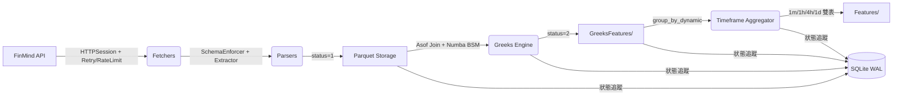

# 量化數據中台 (QuantDataPipeline)

高效能金融數據中台，將 FinMind 原始逐筆數據 (L1) 轉化為**多週期量化特徵表** (L4)，支援高併發、斷點續傳、自動化管線與嚴格的資料驗證。

> 📖 **詳細檔案清單與技術說明**: [docs/FILE_MANIFEST.md](QuantDataPipeline/docs/FILE_MANIFEST.md)  
> 📐 **開發規格書**: [docs/HANDOVER_SPEC_V2.md](QuantDataPipeline/docs/HANDOVER_SPEC_V2.md)

## 系統架構



### 資料流層級

| 層級 | 說明 | 模組 | 狀態碼 |
|------|------|------|--------|
| L0 | 核心設定與 DB | `core/` | — |
| L1 | API 下載原始 Tick | `fetchers/` + `main.py` | 0 → 1 |
| L2 | Greeks 特徵計算 | `compute_greeks_pipeline.py` | 1 → 2 |
| L3 | 多週期聚合特徵 | `processors/timeframe_aggregator.py` | — |
| L4 | 最終 Parquet 產出 | `storage/` | — |

### 狀態機 (`status.db`)

```
0: 待處理 (Pending) → API 下載中或尚未開始
1: L1 成功 → Parquet 已安全寫入
2: L2 成功 → Greeks 計算完成
3: EMPTY_SKIP → 該日無資料，永不重試
```

---

## 環境安裝

```bash
# 1. 複製專案
git clone https://github.com/your-repo/SP_OP_20260220.git
cd SP_OP_20260220/QuantDataPipeline

# 2. 建立虛擬環境
python3 -m venv .venv
source .venv/bin/activate

# 3. 安裝依賴
pip install -r requirements.txt

# 4. (選用) 設定 FinMind API Token + 額度
echo "FINMIND_API_TOKEN=your_token" > .env
echo "FINMIND_QUOTA_PER_HOUR=1600" >> .env  # 系統自動計算最佳速率
```

---

## 快速上手

### 方式一：Google Colab 一鍵啟動 (`colab_launcher.ipynb`) — **推薦**

直接在 Colab 開啟 `colab_launcher.ipynb`，透過**圖形化表單**設定參數後按下播放鍵：

| 表單欄位 | 說明 |
|----------|------|
| `FINMIND_API_TOKEN` | API 金鑰 (需 backer/sponsor 等級) |
| `BRANCH` | GitHub 分支號碼 |
| `LOOKBACK_DAYS` | 回溯天數 (`0` = 全量抓取 2011-01-03 至今) |
| `SKIP_GREEKS` | 是否跳過 Greeks 計算 |
| `DOWNLOAD_WORKERS` | 下載 API 同時併發數 (建議 30~60) |
| `GREEKS_WORKERS` | Greeks 計算核心數 (`0` = 自動偵測) |
| `SYNC_TO_DRIVE` | 是否同步到 Google Drive |
| `RESTORE_FROM_DRIVE` | 斷線續傳：若本地無 Parquet，是否從 Drive 複製回來算 Greeks |
| `CLEANUP_AFTER_SYNC` | 每月同步後自動刪除本地 Parquet，節省 Colab 磁碟空間 |

| `CLEANUP_AFTER_SYNC` | 每月同步後自動刪除本地 Parquet，節省 Colab 磁碟空間 |

**V2 特色**：月批次處理、高併發下載 (繞過 RateLimiter)、多核 Greeks 計算、Drive 嚴格狀態驗證與本地自動清理。
**安全性升級**：
1. **極速斬斷 (Fail-Fast)**：按下停止鍵時，將光速斬除下載線程，並秒速備份資料庫，保證 1 秒內處理不卡死。
2. **基因檢測海關 (Strict Validation)**：所有 Parquet 檔案寫入本地或上傳至雲端前，都會被 Polars 引擎強制讀取校驗。大小為 0 byte 或破壞的檔案會當場捨棄，絕不上傳。

### 方式二：CLI 全自動化管線 (`run_all.py`)

```bash
python run_all.py --lookback 30 --env local          # 倒推 30 天
python run_all.py --start 2024-01-01 --end 2024-01-31  # 指定範圍
python run_all.py --lookback 60 --env colab            # Colab 模式
python run_all.py --lookback 30 --skip-phase2          # 僅下載不計算
```

### 方式三：分步執行

```bash
python main.py --start_date 2024-05-01 --end_date 2024-05-31 --workers 4  # 下載
python compute_greeks_pipeline.py --date 2024-05-02                        # 計算
```

### 執行測試

```bash
python -m pytest tests/ -v --tb=short              # 全量 48 測試
python -m pytest tests/ -v --cov=. --cov-report=term-missing  # 含覆蓋率
```

---

## 目錄結構

```
QuantDataPipeline/
├── core/                           # L0 核心層
│   ├── config.py                   #   全域設定 (路徑/Token/額度/速率/重試)
│   ├── db_metadata_manager.py      #   SQLite WAL 任務狀態管理器 (Singleton)
│   ├── fetch_orchestrator.py       #   任務調度器 (分派到對應 fetcher)
│   └── pipeline_logger.py          #   日誌設定 (RotatingFileHandler)
├── fetchers/                       # L1 資料爬取層
│   ├── datasets/                   #   FinMind API 資料集
│   │   ├── technical/              #     stock_price, stock_price_tick, trading_date
│   │   ├── derivative/             #     option_tick (TXO), futures_tick (TX)
│   │   └── chip/                   #     large_traders (大額交易人)
│   ├── infrastructure/             #   網路基礎設施
│   │   ├── http_session.py         #     HTTP 連線池 + API 統計
│   │   ├── rate_limiter.py         #     全域速率限制器
│   │   └── backoff_retry.py        #     指數退避 + 永久性錯誤偵測
│   └── parsers/                    #   資料解析
│       ├── finmind_extractor.py    #     JSON → Polars DataFrame
│       ├── schema_enforcer.py      #     型別強制 (Datetime[ns], Utf8 補零)
│       └── payload_builder.py      #     API 請求參數建構
├── processors/                     # L2 計算與特徵工程層
│   ├── greeks_engine.py            #   Numba BSM IV + Greeks (核心引擎)
│   ├── market_microstructure.py    #   GEX/PCR/IV_Skew/RV/VRP 特徵
│   ├── timeframe_aggregator.py     #   group_by_dynamic 多週期雙表聚合
│   ├── session_aligner.py          #   日盤/盤後時段對齊
│   └── options_greeks.py           #   (空殼, 已被 greeks_engine 取代)
├── storage/                        # L3 儲存層
│   ├── parquet_writer.py           #   原子性 Parquet 寫入 + MD5 校驗
│   ├── integrity_validator.py      #   MD5 雜湊計算
│   └── monthly_roller.py           #   月度打包 (daily → monthly 合併)
├── tests/                          # 測試 (pytest, 48 cases)
│   ├── conftest.py                 #   Fixtures: tmp_db, mock API, sample DFs
│   ├── test_run_all.py             #   管線 + 狀態機 + 結算日測試
│   ├── test_timeframe_aggregator.py#   多週期聚合測試
│   ├── test_market_microstructure.py#  市場特徵測試
│   ├── test_mock_pipeline.py       #   Mock 單元測試
│   ├── validate_pipeline.py        #   整合驗證 (併發/重試/原子)
│   └── experiments/                #   實驗性腳本 (裸腳本)
├── data/                           # 資料產出 (gitignored)
├── docs/                           # 文件
│   ├── FILE_MANIFEST.md            #   完整檔案清單與技術說明
│   └── HANDOVER_SPEC_V2.md        #   開發規格書
├── colab_launcher.ipynb            # ⭐ Colab 一鍵啟動器 (表單控制面板)
├── main.py                         # L1 下載管線入口
├── run_all.py                      # 全自動化管線入口
├── compute_greeks_pipeline.py      # L2 Greeks 計算管線
├── requirements.txt                # 依賴清單
├── status.db                       # 任務狀態資料庫
└── .env                            # 環境變數 (Token + 額度)
```

---

## 核心特性

| 特性 | 實作 |
|------|------|
| **Colab 一鍵啟動** | 表單化控制面板，固定高度捲軸輸出，API 用量預估與進度追蹤 |
| **斷點續傳** | 每筆任務狀態記錄在 SQLite，中斷後自動從上次暫停處繼續 |
| **Fail-Fast 安全關機** | 收集中斷信號後直接砍斷子線程並於 1 秒內備份 DB，解決執行緒卡死問題 |
| **原子性寫入與基因檢測** | `.tmp` → Polars 讀取驗證第一行 + MD5 → `.parquet`，防止損壞檔案寫入 |
| **高併發安全** | SQLite WAL + Thread-local 連線，經過 20 線程壓測驗證 |
| **這端海關驗證** | Drive 同步時檢查附檔名與檔案大小 (`> 0`)，嚴格拒絕 `.tmp` 或空殼上雲 |
| **API 防護** | 指數退避重試 + 全域速率限制 + 429 冷卻 + 永久性錯誤立即中止 |
| **智慧速率** | 根據 `FINMIND_QUOTA_PER_HOUR` 自動計算最佳請求間隔 (含 10% 安全邊際) |
| **Numba 加速** | BSM Greeks 計算 JIT 編譯，1 秒處理數十萬筆 |
| **多週期聚合** | Polars `group_by_dynamic` 產出 1m/1h/4h/1d 雙表 |
| **混合儲存** | 當月日檔即時更新 + 歷史月檔批量合併 |

## 資料規格 (Schema)

### 核心欄位規範
- **date / timestamp**: `Datetime(time_unit='ns')` — 奈秒精度
- **stock_id**: `Utf8` — 字串格式，保留前綴零 (如 `0050`)

### 雙表結構 (由 `timeframe_aggregator` 產出)

**表 A — 合約級 K 線表**: 每合約每週期 OHLCV + Greeks last 值  
**表 B — 全市場微觀摘要**: 每週期 1 筆 (RV, IV_Skew, Net_GEX, PCR, VRP)

---

## 在地化規範

- 所有文件、註解、日誌輸出採用 **繁體中文**
- 日期格式: `YYYY-MM-DD`
- 時間戳記: Polars `ns` 精度
